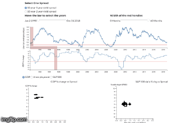

# Yield Curve as a Barometer of the Economy
### By Jayanth Srinivasa and Luis Villarreal
### W209 Data Visualization Section 3 Fall 2018

Hosted: http://people.ischool.berkeley.edu/~luis.villarreal/final_project/

## Description: ##
Combine time series of the S&P 500 Prices and Yield Curve data to provide the user different shapes of the Curve
at important times in the Market.

Also, provide the user with insights of Yield Spreads and other economic data such as Unemployment, GDP Growth.

|Website Preview|
|:---------------:|
|   |

## Data Sources: ##
U.S. Treasury
https://www.treasury.gov/

U.S. Bureau of Labor Statistics
https://www.bls.gov/

## License: ##
This repository and assocatiated visualization is licensed under the MIT license. (http://opensource.org/licenses/MIT)

